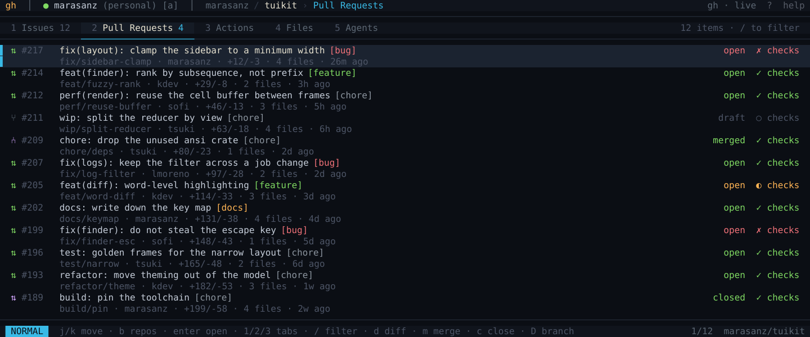
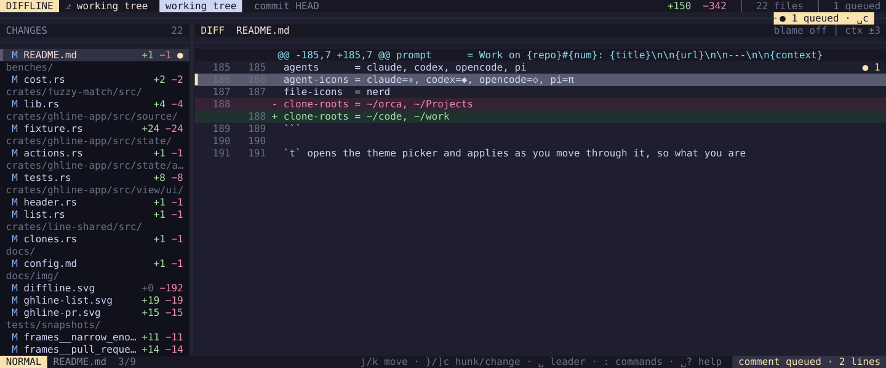

# ghline and diffline

Two terminal interfaces over one set of parts.

**`ghline`** browses GitHub through the [`gh` CLI](https://cli.github.com) —
repositories, issues, pull requests, Actions, files — and can hand any of it to
a coding agent.

**`diffline`** reviews the diff in front of you. Three panes: what changed, the
diff itself, and a queue of notes anchored to lines. Modal and vim-shaped, with
space as the leader.

```sh
diffline            # the repository you are standing in
[s ]s               # working tree · this branch · the last commit
V ␣n                # take a range, note on it
␣a ␣s               # pick an agent, send the queue
␣?                  # everything else
```

They are different programs — one asks a server what exists, the other asks the
working tree what changed — sharing a library: the palette, the fuzzy matcher,
the lexer, the agents on this machine, and the drawing primitives a cell grid
needs.

Written in Rust, on `ratatui` and `crossterm`. No offline mode and no
telemetry: `ghline` shows what `gh` returns, `diffline` shows what `git` says
is in front of you.



*`ghline`, on the pull requests of every repository at once.*



*`diffline`, mid-review: a note anchored to two lines, and one comment queued.*

Both frames are drawn by the programs themselves — see
[terminal-free renders](docs/development.md#terminal-free-renders).

## Why

Reviewing a change and asking someone to fix it are the same sitting, and they
usually are not the same tool. `diffline` keeps them together: the note you
write while reading is the note the agent gets, anchored to the line it was
about.

A comment is anchored to a *line of a file* rather than to a row on screen,
because expanding the context or changing scope renumbers every row — so a note
survives `+`, `r`, and stepping away and back. And the queue travels as **one
message**, grouped by file and in line order, the order the agent will work in.
Twelve separate prompts would get twelve separate answers and no shape.

## Install

```sh
curl -fsSL https://raw.githubusercontent.com/Osmait/ghline/main/install.sh | sh
```

Downloads the release binary for your machine, checks it against the published
SHA-256, and puts it in `~/.local/bin`. No toolchain, no root, and nothing
outside the install directory is touched. Apple Silicon Macs and x86_64/aarch64
Linux are covered; anywhere else builds from source.

Piping a script from the internet into a shell is worth being wary of, so read
it first if you would rather:

```sh
curl -fsSL https://raw.githubusercontent.com/Osmait/ghline/main/install.sh -o install.sh
less install.sh
sh install.sh
```

To choose the location or pin a version:

```sh
GHLINE_INSTALL_DIR=/usr/local/bin GHLINE_VERSION=v0.1.0 sh install.sh
```

The checksum says the download arrived intact — it does not say who made it,
because whoever could swap the tarball could swap the checksum beside it. That
question has its own answer: every release archive carries a provenance
attestation naming the workflow and the commit that produced it.

```sh
gh attestation verify ghline-aarch64-apple-darwin.tar.gz --repo Osmait/ghline
```

### From source

With a Rust toolchain, from a clone:

```sh
make install        # cargo install --path . --locked
make uninstall      # takes it off again
```

`make` on its own lists the rest — `build`, `run`, `test`, `lint`, `check`.
They are thin wrappers over cargo, and `make check` runs exactly what CI runs.

### Requirements

- A **truecolor terminal**. It is drawn for a monospaced font; JetBrains Mono
  is what it was tuned against.
- **`gh`, signed in** — that is how `ghline` reads GitHub. Without it the
  program says which of the two it was and stops; there is nothing it could
  show. The scopes it needs are `repo` (read, merge, close and delete branches)
  and `workflow` (Actions logs).

  ```sh
  gh auth login
  ```

- **`git`** for `diffline`, which reads the repository you point it at.
- [**herdr**](https://herdr.dev) only if you want to send anything to an agent.
  Both programs work without it; the agent tab is simply empty.

## Getting started

```sh
ghline              # opens on all repositories at once
```

The interface is a grid of panes, walked the way you walk windows in vim:
`h` and `l` move focus to the neighbouring pane, and `j`/`k` always act on
whichever one has it. `enter` drills in, `esc` walks back out, and `?` lists
every key.

A session opens on **all repositories** rather than on one of them: with a
hundred repos, "what is going on" is a better first question than "in which
one". `[` steps off it onto a single repository whenever you want the narrower
view.

```sh
diffline            # the repository you are standing in
```

`j`/`k` walks the changed files, `l` moves into the diff. `V` takes a range,
`␣n` writes a note against it, `␣a` picks a destination and `␣s` sends
everything queued as one message. The leader is space, and `␣?` lists every
binding — generated from the live keymap, so it is right the moment you rebind
something.

### The keys you need first

| Key | Action |
| --- | --- |
| `j` `k` | move within the pane |
| `h` `l` | pane left / right |
| `enter` | enter the pane / open |
| `esc` `q` | back one level |
| `1` `2` `3` | Issues / Pull Requests / Actions |
| `4` | files, and the agents that are running |
| `d` | diff of the pull request's files |
| `p` `^p` | the finder |
| `/` | filter the list or the log |
| `x` | send what you are standing on to an agent |
| `t` | switch theme |
| `r` | refresh |
| `?` | help |
| `ctrl-c` | quit |

`q` and `:q` go back or close the overlay; to quit the program use `ctrl-c`.
These are ghline's; diffline is modal and has its own, listed by `␣?`. The full
tables are in [docs/ghline.md](docs/ghline.md#keys) and
[docs/diffline.md](docs/diffline.md#keys).

## Documentation

| | |
| --- | --- |
| [docs/ghline.md](docs/ghline.md) | panes and where each one comes from, navigation, the file explorer, the diff, the pull request flow, the finder, the mouse, the full keymap |
| [docs/diffline.md](docs/diffline.md) | scopes, how a comment is anchored, the queue, rebinding keys |
| [docs/agents.md](docs/agents.md) | what travels for each kind of subject, the three destinations, prompt templates, how a checkout is found |
| [docs/config.md](docs/config.md) | `~/.config/ghline/config`, prompt templates, icons, themes and writing your own |
| [docs/development.md](docs/development.md) | layering, tests and golden frames, benchmarks, terminal-free renders, session recording |

## Configuration

Optional, and all of it plain text. `~/.config/ghline/config` (or
`$XDG_CONFIG_HOME`) is `key = value` lines:

```
prompt      = Work on {repo}#{num}: {title}\n\n{url}\n\n---\n\n{context}
agents      = claude, codex, opencode, pi
agent-icons = claude=✳, codex=◆, opencode=◇, pi=π
file-icons  = nerd
clone-roots = ~/orca, ~/Projects
```

`t` opens the theme picker and applies as you move through it, so what you are
judging is the interface rather than a name in a list; `enter` writes the one
you keep back to the config. Two themes ship, and anything in
`~/.config/ghline/themes/*.theme` joins the picker. diffline's keymap is a
table rather than a `match`, so `<config>/keys` is read at startup and applied
over the shipped one.

All of it is in [docs/config.md](docs/config.md).

## Architecture

A cargo workspace: the two programs are libraries, and `src/` holds only the
entry points.

| Path | Contents |
| --- | --- |
| `crates/ghline-app/` | GitHub model, `gh` source, state and views |
| `crates/diffline-app/` | diff model, VCS source, review state and views |
| `crates/line-shared/` | configuration, clone discovery, logging and worker contracts |
| `crates/tui-kit/` | terminal runtime, drawing primitives, themes and input |
| `crates/source-text/` | syntax highlighting, wrapping and terminal-safe text |
| `crates/agent-mux/` | agent discovery and dispatch through multiplexers |
| `crates/cli-parser/` | command-line parsing, with no application policy in it |
| `crates/fuzzy-match/` | greedy fuzzy scoring and stable ranking |
| `crates/process-error/` | typed failures from subprocess-backed services |
| `src/bin/` | process setup and terminal adapter for each program |

Each application follows the same one-way stack:

```
view → state → source → data/model
              │
              └── blocking gh/git work stays on a worker thread
```

`ghline-app` and `diffline-app` never depend on each other, and nothing shared
is allowed to name either of them — Cargo enforces that rather than a comment.
No view imports a process source, so rendering can never reach GitHub or Git,
and nothing on the drawing thread waits for the network: a pending panel draws
the outline of what is coming and the rows replace it when they arrive.

[docs/development.md](docs/development.md) has the rest, including how the
golden frames work and how to render a screen without a terminal.

## Contributing

`make check` is the gate — it runs lints, the rustdoc lints, and the whole
suite, and it is exactly what CI runs. [AGENTS.md](AGENTS.md) is the map of the
repository and [CODE-STYLE.md](CODE-STYLE.md) the rulebook: panics, errors,
naming, visibility, documentation, tests and dependencies.

Two things are worth knowing before a first patch. `unsafe` is forbidden
workspace-wide, and `unwrap`, `expect`, `panic!`, `todo!`, `dbg!` and `print!`
warn outside the modules that legitimately need them. And a golden frame is
only worth what the look at it was worth — accepting one you have not read
turns a failing test into a passing one and nothing else.

## Licence

MIT. The text is in [LICENSE-MIT](LICENSE-MIT).

Any contribution you deliberately submit for inclusion in this work shall be
licensed as above, with no additional terms.
