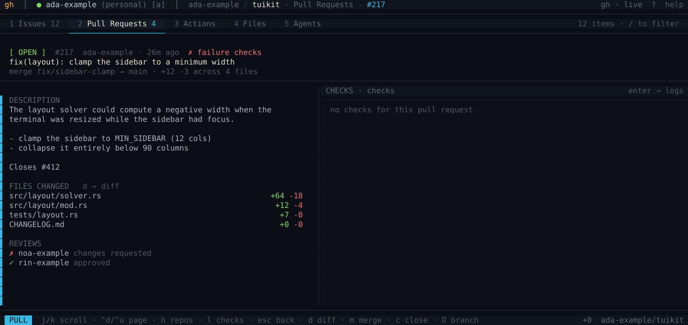

# ghline

Browsing GitHub from the terminal: repositories, issues, pull requests,
Actions and files, read through the [`gh` CLI](https://cli.github.com).

Everything here assumes a signed-in `gh` — see [the README](../README.md#install)
for that. Sending any of it to a coding agent is [its own page](agents.md);
settings, themes and colours are in [config.md](config.md).

## Where each panel comes from

| Panel | Source |
| --- | --- |
| Accounts | `gh api user` and `gh api user/orgs` |
| Repos and counters | one GraphQL query with open issues and PRs |
| Issues / PRs / Actions | `gh issue list`, `gh pr list`, `gh run list` |
| Detail | `gh issue view`, `gh pr view` |
| Checks | `gh run view --json jobs` for the run tied to the PR |
| Diff | `gh pr diff`, split per file and per hunk |
| Logs | `gh run view --log`, split per job and step |
| Actions | `gh pr merge/close/reopen` and `DELETE /git/refs` |

The calls run on a separate thread, so the interface never hangs. While a
response is on its way each panel draws the outline of what is coming —
placeholder rows in the proportions the real ones will have, with a highlight
band travelling down them — rather than a word in an empty box, so nothing
jumps when the data lands. A failure shows the `gh` error instead. `r` drops
the active repo's caches and asks for everything again.

## Navigation

The interface is a grid of panes, walked the way you walk windows in vim:
**`h` and `l` move focus to the neighbouring pane, and `j`/`k` always act on
whichever one has it**. The focused pane is marked with a cyan bar: panes with a
selection put it on the selected row, and panes that only scroll (the body and
the log) put it against the left edge.

| View | Panes, left to right |
| --- | --- |
| List | Repositories · Issues/PRs/Actions |
| Issue | Repositories · Body |
| PR or run | Repositories · Description · Checks |
| Diff | Changed files · Diff |
| Logs | Jobs and steps · Output |

## All repositories

A session opens on **all repositories** rather than on one of them: with a
hundred repos, "what is going on" is a better first question than "in which
one". It is the first row of the repository pane, and `[` steps off it onto a
single repository whenever you want the narrower view.

Issues and pull requests are one GraphQL search each, so gathering them costs
no more than opening a single repository would — and the rows lose nothing:
the diff counts, the file count and the branch are all in the same answer.
Every row says which repository it came from, and `/` filters on that as well
as on the title, so `/sbql` narrows a mixed list back down to one project.

Actions cannot be gathered the same way, because GitHub has no cross-repository
Actions API — it really is one call per repository. Two things keep that
honest: the repository query already asks which repos have a
`.github/workflows` directory at all, so only those are called (twenty of a
hundred and forty-three, here), and the calls go out sixteen at a time. It
lands in about a second and a half.

What a row belongs to and what pane it is listed in are no longer the same
thing, so everything downstream of the selection — the body, the diff, the
checks, the logs, and merging or closing it — follows the item's own
repository. That matters more than it sounds: a gathered list really does hold
two different `#14`s, and both the request and the answer have to name the
repository or one pull request's body ends up on the other.

The repository pane starts hidden: with sixty repositories it is a wall, and
`[`/`]` step through them without it while the finder reaches any of them by
name. `b` brings it back and gives its width to the content. It stays
hidden until you ask for it back, and the logs and diff views never show it —
the logs and the diff get the full width. Below 90 columns there is not enough room
for it whatever you asked for, and in every one of those cases `h` will not walk
to it, because a pane that is not on screen is not a pane.

`enter` drills into the focused pane — repos to the list, list to the detail,
checks to the logs, the tree to the output — and `esc` walks that same path
back. `tab` cycles through the panes, wrapping around; `h`/`l` stop at the ends.

## Files

`4` is the repository's file tree, read straight off GitHub — no clone needed.
A tree on the left, the file on the right, the same two-pane shape as the logs
and the diff. Directories start closed; `enter` or `o` opens one, `enter` on a
file moves to its contents, and `x` sends the file to an agent.

The whole tree comes down in one request against `HEAD`, so nothing has to know
what the default branch is called and opening a directory costs nothing. Only
the file you actually select is fetched, and only if it is under half a
megabyte — past that the pane says how big it is rather than stalling on it. A
file that turns out to be binary says so instead of painting the pane with
replacement characters, and a tree GitHub truncated says that too, because a
partial listing that stays quiet reads as a smaller repository.

### Editing one

`E` opens the file under the cursor in your editor, at the line under the
cursor — `$VISUAL`, then `$EDITOR`, then nvim, then vim. The TUI hands over the
whole terminal and takes it back afterwards, unconditionally, so an editor that
dies badly still leaves this program with a terminal it can use.

Two things stand between the key and the editor, and both are worth knowing
about rather than being surprised by.

**The repository may not be here.** If it is not on disk, `E` offers to clone
it — `gh repo clone` into the first of your `clone-roots` that exists — and
opens the file once it lands. Fetching a whole repository takes a while, so it
asks first, and the interface stays usable while it runs.

**The checkout may be on another branch.** The explorer reads GitHub's `HEAD`;
an editor reads the disk. Those are two different files whenever the local
clone is somewhere else, which is the usual case rather than the exception —
two of the three checkouts on the machine this was built on are on feature
branches. So `E` says which branch it is about to edit, and if the file is not
in the checkout at all it says that instead of opening an empty buffer.

It does **not** switch branches for you. Moving someone off their branch to
satisfy a keypress is a far worse surprise than a warning.

If the repository has not been located yet, `E` remembers the keypress, asks
for the disk to be walked, and opens the file when the answer arrives. It used
to say it was looking while nothing had been asked to look.

Once you are in the editor, [`agentline.nvim`](https://github.com/Osmait/agentline.nvim)
closes the loop: select some lines, ask a question, and it goes to a running
agent with the file, the range and the text. It is a separate Neovim plugin
that only needs herdr, with its own installation instructions and history.

`/` finds a file without walking to it: the filter flattens the tree, matches on
the whole path rather than the name, and leaves the directories out, since a
directory is not something you can read or send.

Files and folders carry the same Nerd Font glyphs `nvim-web-devicons` uses, so
a file looks the same here as in the editor this hands it to — that
familiarity is the point, and an original set would be one nobody recognises.
`file-icons = plain` falls back to two marks any terminal can draw, and `none`
turns them off, because a column of replacement boxes is worse than no icons.

### Colour

Source is coloured by a lexer, not a parser, and that is a deliberate trade.
tree-sitter would mean a C toolchain in a project that has none, plus one
grammar crate per language — perfect colour for the languages someone
remembered to bundle and none at all for the rest. syntect is pure Rust with
`fancy-regex` but brings forty-nine crates and embeds its own syntax
definitions.

This pane is read-only. Comments, strings, numbers and keywords are what an eye
uses to find its place, and a lexer finds those in about a dozen languages and
approximately in the rest. What it does not find is structure: a type is
coloured when it *looks* like one, and a macro or a regex will occasionally be
read as something it is not. That is the honest cost of the trade.

Lexing runs on the service thread with the fetch, not between frames — half a
megabyte takes long enough to be a dropped frame otherwise. Multi-line
constructs mean a line cannot be read on its own, so a file is lexed whole when
it lands.

Contents are wrapped rather than cut — a long line in a config file is still
worth reading, and there is no horizontal scroll here. The wrap is by column
rather than by word, which keeps indentation meaning something and, not
incidentally, keeps the byte offsets a colour span is written in.

## Files and diff

`d` on a pull request opens the diff view: the changed files with their counts
on the left, the contents on the right. `j`/`k` walks the files, `l` moves to
the diff and `j`/`k` scrolls it there.

- `s` switches between the unified diff (two numbering columns, original and
  new) and the split one (deletions left, additions right).
- `w` ignores whitespace-only changes: `-`/`+` pairs whose contents match once
  whitespace is removed collapse into a single context line.
- A file with no textual changes — a binary, a mode change — shows
  "no textual changes" instead of an empty pane.

From the PR detail, `enter` on the body opens that same view.

## Pull request flow

The action is executed by `gh` and the list is reloaded from what GitHub
reports, never from a local guess — a merge that failed should not leave a row
that says it worked. The flow:

1. `m` opens the merge confirmation, which first shows the state of the checks,
   how many approvals there are and whether anyone requested changes.
2. You pick the method — merge commit, squash or rebase — and confirm with
   `enter`.
3. The branch-deletion confirmation follows immediately, like the button GitHub
   offers after a merge.
4. The PR becomes `merged`, the branch is marked with `⊘`, and the repo's
   open-PR count is adjusted in the tab and in the sidebar.

The branch-deletion prompt only appears **if the merge succeeded**, and it
carries the branch name with it rather than re-reading the selection: by the
time the response arrives, the list has already been reloaded. The modal shows
the `owner/repo` you are about to act on.

The rules are GitHub's: a *draft* PR cannot be merged, an already merged PR
cannot be closed, and the branch is only deleted once the PR is resolved. When
an action does not apply, the reason appears in the status bar. Closing a PR can
be undone by reopening it with `c`.

The changes are real changes on GitHub.

## The finder

`p` — or `^p` — opens it over everything else. `tab` walks the four sources and
keeps what you typed, since switching usually means "the same words, somewhere
else". `↑`/`↓` or `^n`/`^p` move, `enter` goes there, `esc` closes.

| Source | Where it looks |
| --- | --- |
| repos | the repositories already loaded, filtered as you type |
| issues | `gh search issues` across your repositories |
| pull requests | `gh search prs` across your repositories |
| commits | `gh search commits` across your repositories |

Repositories are already in memory, so they filter with no latency and the
matched letters are highlighted. The other three go to GitHub once typing
pauses, and are shown in the order the server ranked them.

Commits are the exception worth knowing about: GitHub rejects a commit search
made of qualifiers alone, so that source has nothing to show until you type
something. The other three list without a query.

Matching is a small scorer in `crates/fuzzy-match/` rather than a dependency — letters
that run together beat letters scattered about, the start of a word beats the
middle, and a shorter name beats a longer one. It matches greedily, which is
documented where it could otherwise look like a bug.

## Markdown

Bodies are Markdown, and they are rendered as such: headings lose their hashes
and gain weight, emphasis becomes emphasis, inline code and links take the
active palette, and tables keep their shape. `tui-markdown` does the parsing,
taken without its default feature so that syntax colouring inside fences — and
the C dependency it brings — stays out of the build.

## The mouse

It is there if you want it, and it adds nothing the keyboard cannot already do.
A click is `h`/`l` then `j`/`k`: it focuses the pane it landed on and selects
the row under the pointer. A double click is `enter`. The wheel is `j`/`k`, on
whatever the pointer is over — reaching for a pane to read it is not a decision
to work in it, so scrolling never takes the focus. Tabs are clickable, and so
are the rows of the finder, the theme picker and the account switcher; clicking
away from one closes it, on the same terms as `esc`.

A confirmation ignores the mouse entirely. "Merge this?" wants a deliberate
answer, and a stray click is not one.

Only the renderer knows where anything ended up, so each pane records the
rectangle it drew and enough to turn a row back into an index (`crates/tui-kit/src/hit.rs`).
They are rebuilt every frame and read newest-first, which is what puts a modal
in front of the panes it covers without either having to know about the other. A
pane the renderer forgets to register is a pane the mouse cannot reach and
nothing else would notice, so a test walks every pane of every view and fails if
one is missing.

Capturing the mouse takes the terminal's own click-to-select with it. Most
terminals still select with `shift` held down; `--no-mouse` turns the whole
thing off if you would rather have it back.

## Keys

| Key | Action |
| --- | --- |
| `j` `k` | move within the pane |
| `h` `l` | pane left / right |
| `tab` | next pane (cycles) |
| `d` | diff of the PR's files |
| `s` | split / unified diff |
| `w` | ignore whitespace-only changes |
| `g` `G` | start / end of the pane |
| `^d` `^u` | half a page |
| `PgUp` `PgDn` | a whole page |
| `1` `2` `3` | Issues / Pull Requests / Actions |
| `enter` | enter the pane / open |
| `esc` `q` | back one level |
| `a` | switch account |
| `t` | switch theme (`␣t` in diffline) |
| `b` `^b` | hide / show the repository pane |
| `[` `]` | previous / next repository |
| `p` `^p` | the finder |
| `o` | fold / unfold a job (in the logs) |
| `/` | filter (list or log) |
| `e` | jump to the first error in the log |
| `f` | toggle the log's *follow* mode |
| `r` | refresh |
| `:` | command line |
| `?` | help |
| `^l` | repaint the screen |
| `ctrl-c` | quit |

On a pull request:

| Key | Action |
| --- | --- |
| `m` | merge (pick the method with `1` `2` `3`) |
| `c` | close, or reopen if already closed |
| `D` | delete the branch |
| `y` / `enter` | confirm |
| `n` / `esc` | cancel |

Commands: `:account`, `:issues`, `:prs`, `:actions`, `:logs`, `:diff`, `:files`,
`:theme`, `:sidebar`, `:find`, `:help`, `:q`.

`q` and `:q` go back or close the overlay; to quit the program
use `ctrl-c`.

## Limits worth knowing

- Below 90 columns the repository pane is hidden whatever you asked for, and
  below 40x8 a notice is shown instead of the interface.
- The visibility column of the repository pane is empty: the colour is defined
  (yellow when private) but the glyph is not. The markers live in
  `theme::PRIVATE_MARK` and `theme::PUBLIC_MARK` for anyone who wants to fill
  them in.
- There is no offline mode. What is not on GitHub is not here; the only fake
  data in the program is a page of fixture the tests are written against, and
  it is not something you can start the program on.
